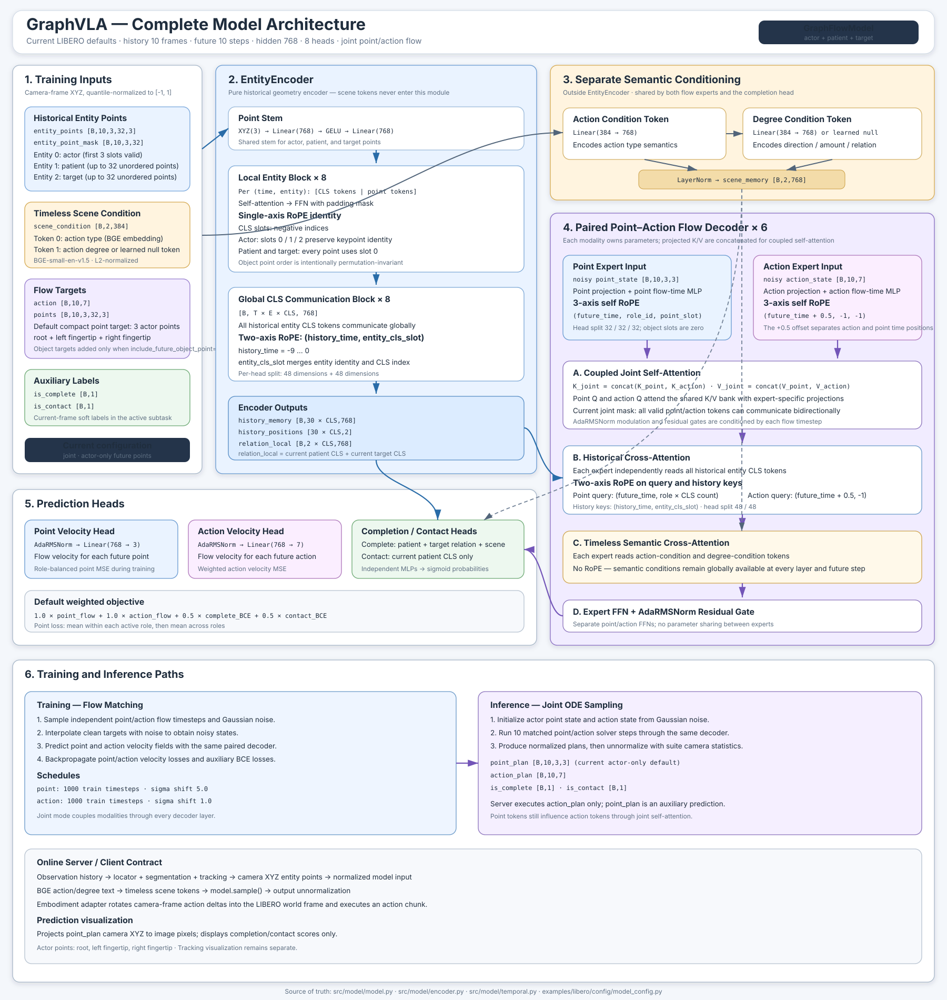

# GraphVLA model architecture

This diagram describes the current LIBERO configuration and implementation as of 2026-08-01.

Key conventions:

- Historical time spans `-9 ... 0`; future time spans `1 ... 10`.
- Actor point slots are `root`, `left fingertip`, and `right fingertip`.
- Patient and target point sets are unordered; their object point-slot RoPE coordinate is always zero.
- Scene conditions do not enter `EntityEncoder`. Both flow experts read them through a separate cross-attention without RoPE.
- The default mode is `joint` with actor-only future point prediction.
- `point_plan` is auxiliary at execution time, but it interacts bidirectionally with action tokens inside the joint decoder.

The older `graphvla_architecture.svg` in this directory documents a previous architecture and should not be used as the current model reference.
